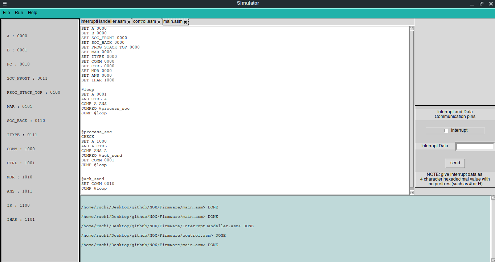

# NOX - Network Operating System

In this project, we basically designed a custom network related hardware architecture. To integrate it with existing systems, we created a firmware written on custom assembly language created by us. We also created an enmulator to emulate hardware and a simulator to test assembly language with hardware interrupts.

This repo contains a simulator, emulator, firmware, assembler and a proposed archetecture for the same. Below are the screenshot for the simulator.

